# Multi-Agent Workflow Template

A template for building intelligent multi-agent systems using the Microsoft Agent Framework. This template demonstrates a coordinator-based architecture where a central agent orchestrates specialized tool agents to handle complex tasks through natural language interaction.

## What is This Template?

This is a **starter template** for building multi-agent workflow applications. It provides:

- 🏗️ **Production-ready architecture** - Coordinator pattern with pluggable tool agents
- 🔌 **Easy extensibility** - Add new capabilities by creating tool agents
- 🚀 **Local-first approach** - Runs entirely on your machine using Ollama
- 📚 **Best practices** - Configuration management, logging, testing patterns
- 🎯 **Real example** - Includes a working URL scraper agent to learn from

**Who is this for?**
- Developers building AI agent applications with the Microsoft Agent Framework
- Teams creating workflow automation with multiple specialized agents
- Anyone wanting to understand coordinator-based multi-agent architectures

## How It Works

```mermaid
graph TB
    User[👤 User] -->|Natural language query| CLI[CLI Interface]
    CLI -->|User message| Coordinator[🎯 Coordinator Agent]
    
    Coordinator -->|Routes tasks| URLScraper[🌐 URL Scraper Agent]
    Coordinator -->|Routes tasks| CustomAgent1[⚙️ Your Custom Agent]
    Coordinator -->|Routes tasks| CustomAgentN[⚙️ More Agents...]
    
    URLScraper -->|Uses| FetchTool[fetch_url Tool]
    URLScraper -->|Analyzes with| Ollama1[🤖 Ollama LLM]
    
    Coordinator -->|Synthesizes with| Ollama2[🤖 Ollama LLM]
    
    Coordinator -->|Response| CLI
    CLI -->|Display| User
    
    style Coordinator fill:#e1f5ff
    style URLScraper fill:#fff4e1
    style CustomAgent1 fill:#f0f0f0,stroke-dasharray: 5 5
    style CustomAgentN fill:#f0f0f0,stroke-dasharray: 5 5
```



**The Flow:**
1. **User** sends a natural language query through the CLI
2. **Coordinator Agent** analyzes the request and determines which tool agents to invoke
3. **Tool Agents** (like URL Scraper) perform specialized tasks using their own tools and LLM reasoning
4. **Coordinator** synthesizes results from tool agents into a coherent response
5. **User** receives the final answer

This architecture allows you to add specialized agents for any domain (databases, APIs, file processing, etc.) without modifying the coordinator.

## What's Included (Out of the Box)

- **Coordinator Agent**: Central orchestrator that communicates with users and routes tasks
- **URL Scraper Agent Tool**: Fetches and analyzes web content from URLs
- **CLI Interface**: Simple command-line chat interface for interaction
- **Ollama Integration**: Local LLM inference optimized for consumer hardware
- **Configuration System**: YAML-based config with environment variable support
- **Testing Framework**: pytest setup with async support and mocking examples
- **Documentation Templates**: Structured docs for agents, requirements, and design

## Common Use Cases

This template can be adapted for various multi-agent scenarios:

| Use Case | How to Adapt |
|----------|--------------|
| **Research Assistant** | Add agents for academic paper search, citation management, summarization |
| **DevOps Helper** | Add agents for log analysis, infrastructure queries, deployment automation |
| **Content Analyzer** | Add agents for document processing, sentiment analysis, content generation |
| **Data Pipeline** | Add agents for data validation, transformation, quality checking |
| **Customer Support** | Add agents for ticket analysis, knowledge base search, response generation |
| **Code Assistant** | Add agents for code search, documentation generation, refactoring suggestions |

Each use case involves creating specialized tool agents that the coordinator can invoke based on user requests.

## Requirements

- Python 3.11+
- [Ollama](https://ollama.com/) installed and running
- 8GB RAM minimum (for running local models)

## Quick Start

### 1. Install Ollama

Download and install Ollama from [ollama.com](https://ollama.com/).

### 2. Pull a Model

For systems with 8GB RAM and integrated graphics, we recommend `qwen2.5:3b` or `llama3.2:3b`:

```bash
ollama pull llama3.2:3b
```

Other lightweight options:
- `phi3:mini` - Fast, good for simple tasks
- `qwen2.5:3b` - Good tool calling support

### 3. Install Dependencies

```bash
# Create virtual environment
uv venv --python=3.13.11

# Activate (Windows)
.venv\Scripts\activate

# Activate (Linux/Mac)
source .venv/bin/activate

# Install package with dependencies (--pre required for agent-framework preview)
uv pip install -e ".[dev]" --pre
```

### 4. Configure

Copy the example environment file:

```bash
copy .env.example .env   # Windows
cp .env.example .env     # Linux/Mac
```

Edit `.env` to match your Ollama setup:

```env
OLLAMA_HOST=http://localhost:11434
OLLAMA_MODEL_ID=llama3.2:3b
```

### 5. Run

```bash
# Make sure Ollama is running
ollama serve

# In another terminal, start the CLI
python -m app.cli
```

Or use the entry point:

```bash
workflow
```

## Usage

Once running, you can:

1. **Ask questions**: Type any question and press Enter
2. **Analyze URLs**: Paste a URL to fetch and analyze its content
3. **Commands**:
   - `/new` - Start a new conversation
   - `/config` - Show current configuration
   - `/loglevel [level]` - Set logging level (DEBUG, INFO, WARNING, ERROR)
   - `/help` - Show help message
   - `/quit` - Exit the application

### Example

```
You: Is there anything useful at https://kubernetes.io/docs/concepts/overview/ for my DevOps team?

Coordinator: Let me fetch and analyze that URL for you...

URL: https://kubernetes.io/docs/concepts/overview/
Title: Kubernetes Concepts Overview

This page provides a comprehensive overview of Kubernetes architecture and key concepts...
[Analysis and summary of relevant DevOps practices]
```

## Customizing This Template

### Making It Your Own - Checklist

Use this checklist to adapt the template for your specific use case:

- [ ] **Rename the project**
  - Update `name` in `pyproject.toml`
  - Update title and description in `README.md`
  - Update `user_agent` in `config/config.yaml`

- [ ] **Configure for your environment**
  - Review and update `.env` with your Ollama settings
  - Adjust `config/config.yaml` for your needs (timeouts, model preferences, etc.)
  - Update logging configuration in `config/config.yaml`

- [ ] **Remove or modify example agent**
  - Keep URL Scraper agent if useful for your use case
  - Remove `app/agents/tools/url_scraper.py` if not needed
  - Delete `tests/test_url_scraper*.py` if removing the agent
  - Update `app/agents/coordinator.py` to remove URL scraper import/registration

- [ ] **Add your custom agents**
  - Create new agent files in `app/agents/tools/`
  - Follow the pattern in `url_scraper.py` for tool registration
  - Register new agents in `app/agents/coordinator.py`
  - Use `docs/agents/agent-doc-template.md` for documentation
  - Add tests in `tests/` following existing patterns

- [ ] **Update documentation**
  - Replace `docs/PRD.md` with your product requirements
  - Update `docs/SRS.md` with your system requirements  
  - Modify or remove `docs/UI-Design.md` based on your interface plans
  - Update agent documentation in `docs/agents/`

- [ ] **Customize the interface**
  - Modify `app/cli.py` for your CLI needs
  - Or add a web UI (Streamlit/Gradio) as described in PRD.md
  - Update commands and help text to match your use case

- [ ] **Add your domain knowledge**
  - Create knowledge stores as needed (see PRD.md for ideas)
  - Implement context agents for organization-specific information
  - Add style examples or templates for your output format

### Adding a New Tool Agent

Here's a quick guide to adding your own specialized agent:

1. **Create agent file**: `app/agents/tools/your_agent.py`

```python
from agent_framework import ChatAgent
from agent_framework.ollama import OllamaChatClient
from app.config import get_config

class YourAgent:
    """Your specialized agent description."""
    
    def __init__(self):
        config = get_config()
        self.client = OllamaChatClient(
            host=config.models.ollama.host,
            model_id=config.models.ollama.model_id,
        )
        self.agent = ChatAgent("YourAgent", model_client=self.client)
        
        # Register your tools with the agent
        # self.agent.register_tool(your_tool_function)
    
    async def run(self, query: str) -> str:
        """Run the agent with a query."""
        return await self.agent.run(query)
    
    def as_tool(self):
        """Register this agent as a tool for other agents."""
        from pydantic import Field
        
        async def your_agent_tool(
            request: str = Field(..., description="Description of what this agent does")
        ) -> str:
            """Tool description for the coordinator."""
            return await self.run(request)
        
        return your_agent_tool
```

2. **Register in coordinator**: Update `app/agents/coordinator.py`

```python
from app.agents.tools.your_agent import YourAgent

# In __init__:
self.your_agent = YourAgent()
self.agent.register_tool(self.your_agent.as_tool())
```

3. **Add configuration**: Update `config/config.yaml`

```yaml
agents:
  your_agent:
    name: "YourAgent"
    description: "What your agent does"
```

4. **Document it**: Create `docs/agents/your_agent.md` using the template

5. **Test it**: Add tests in `tests/test_your_agent.py`

See `app/agents/tools/url_scraper.py` for a complete working example.

## Project Structure

```
.
├── app/
│   ├── agents/
│   │   ├── coordinator.py       # Main orchestrator agent
│   │   └── tools/
│   │       └── url_scraper.py   # Example tool agent
│   ├── cli.py                   # Command-line interface
│   ├── config.py                # Configuration schema
│   └── logging_config.py        # Logging setup
├── config/
│   └── config.yaml              # Application configuration
├── docs/
│   ├── agents/                  # Agent documentation
│   ├── PRD.md                   # Product requirements
│   └── SRS.md                   # System requirements
├── tests/                       # Test suite
├── .env.example                 # Environment template
├── pyproject.toml               # Python package config
└── README.md                    # This file
```

## Development

### Running Tests

```bash
# Run all tests
pytest

# Run with coverage
pytest --cov=app

# Run specific test file
pytest tests/test_coordinator.py

# Run with debug output
pytest -v -s
```

### Logging

Set log level via CLI command or config:

```bash
# In the application
/loglevel DEBUG

# Or in config/config.yaml
logging:
  level: "DEBUG"
```

### Adding Dependencies

```bash
# Add a new dependency
uv pip install package-name

# Update pyproject.toml
# Add to dependencies list in pyproject.toml
```

## Architecture Notes

### Why Coordinator Pattern?

The coordinator pattern provides:
- **Separation of concerns**: Each agent focuses on one capability
- **Modularity**: Add/remove agents without affecting others
- **Scalability**: Agents can run in parallel or be distributed
- **Maintainability**: Easier to test and debug individual agents

### Agent-as-Tool Pattern

Tool agents are registered with the coordinator using the agent-as-tool pattern:
- Each tool agent is a full agent with its own LLM client
- The coordinator invokes them as tools via natural language
- Tool agents can have their own tools (composition)
- This allows complex multi-step reasoning within each agent

### Configuration Philosophy

- **Environment variables** (`.env`): Deployment-specific settings (hosts, API keys)
- **Config file** (`config.yaml`): Application behavior and agent configuration  
- **Code defaults**: Fallbacks when config is not provided

## Troubleshooting

### Common Issues

| Issue | Solution |
|-------|----------|
| `Connection refused` to Ollama | Make sure Ollama is running: `ollama serve` |
| `Model not found` | Pull the model: `ollama pull llama3.2:3b` |
| `ImportError` for agent-framework | Install with `--pre` flag: `uv pip install -e ".[dev]" --pre` |
| Slow responses | Try a smaller model (1.5b or 3b) or increase timeout in config |
| Out of memory | Use a smaller model or increase RAM allocation |

### Getting Help

1. Check the [Microsoft Agent Framework docs](https://github.com/microsoft/agent-framework)
2. Review agent documentation in `docs/agents/`
3. Look at existing tests for usage examples
4. Check logs with `/loglevel DEBUG` for detailed information

## Contributing

This is a template repository. Fork it and make it your own! 

If you create interesting agents or improvements to the template structure, consider sharing them back with the community.

## License

See [LICENSE.md](LICENSE.md) for details.

## Acknowledgments

Built with:
- [Microsoft Agent Framework](https://github.com/microsoft/agent-framework) - Agent orchestration
- [Ollama](https://ollama.com/) - Local LLM inference
- [BeautifulSoup](https://www.crummy.com/software/BeautifulSoup/) - HTML parsing
- [httpx](https://www.python-httpx.org/) - HTTP client
- [pytest](https://pytest.org/) - Testing framework
