# Agent Workflow Architecture

```mermaid
flowchart TB
    subgraph UI["User Interfaces"]
        CLI["CLI<br/><code>app/cli.py</code>"]
        Web["Streamlit Web UI<br/><code>app/web.py</code>"]
    end

    User(("👤 User")) --> CLI & Web

    CLI & Web --> Coordinator

    subgraph Agents["Agent Layer"]
        Coordinator["🎯 CoordinatorAgent<br/><code>app/agents/coordinator.py</code><br/><i>Orchestrates all tool agents</i>"]

        subgraph ToolAgents["Tool Agents (agent-as-tool)"]
            URLScraper["🔗 URLScraperAgent<br/><code>url_scraper.py</code>"]
            KnowledgeIngestion["📥 KnowledgeIngestionAgent<br/><code>knowledge_ingestion.py</code>"]
            OrgContext["📚 OrgContextAgent<br/><code>org_context.py</code>"]
        end

        subgraph ToolFunctions["Tool Functions (direct)"]
            KnowledgeRetrieval["🏷️ Knowledge Retrieval<br/><code>knowledge_retrieval.py</code>"]
        end
    end

    Coordinator -- "as_tool()" --> URLScraper
    Coordinator -- "as_tool()" --> KnowledgeIngestion
    Coordinator -- "as_tool()" --> OrgContext

    subgraph URLScraperTools["URL Scraper Tools"]
        fetch_url["fetch_url()"]
    end
    URLScraper --> fetch_url
    fetch_url -->|"httpx + lxml"| Internet(("🌐 Web"))

    subgraph OrgContextTools["Org Context Tools"]
        get_instructions_context["get_instructions_context()"]
        get_notes_index["get_notes_index()"]
        read_note["read_note()"]
        get_url_index["get_url_index()"]
        search_knowledge["search_knowledge()"]
    end
    OrgContext --> get_instructions_context & get_notes_index & read_note & get_url_index & search_knowledge

    subgraph IngestionTools["Knowledge Ingestion Tools"]
        add_url_to_index["add_url_to_index()"]
        update_instructions_file["update_instructions_file()"]
        create_note["create_note()"]
        get_knowledge_status["get_knowledge_status()"]
    end
    KnowledgeIngestion --> add_url_to_index & update_instructions_file & create_note & get_knowledge_status

    subgraph RetrievalTools["Knowledge Retrieval Tools"]
        get_available_tags["get_available_tags()"]
        search_by_tags["search_by_tags()"]
    end
    KnowledgeRetrieval --> get_available_tags & search_by_tags

    subgraph Knowledge["Knowledge Store<br/><code>knowledge/</code>"]
        context_md["📄 context.md<br/><i>Org-level context</i>"]
        url_index["📋 sources/url_index.yaml<br/><i>Indexed URLs</i>"]
        notes_index["📋 notes/_index.yaml<br/><i>Notes index</i>"]
        notes_files["📝 notes/*.md<br/><i>Detailed notes</i>"]
    end

    get_instructions_context & search_knowledge --> context_md
    get_notes_index --> notes_index
    read_note --> notes_files
    get_url_index --> url_index

    update_instructions_file --> context_md
    add_url_to_index --> url_index
    create_note --> notes_files & notes_index

    get_available_tags & search_by_tags --> notes_index & url_index

    subgraph Infra["Infrastructure"]
        Ollama["🦙 Ollama<br/><i>Local LLM inference</i>"]
        Config["⚙️ Config<br/><code>config/config.yaml</code>"]
        Metrics["📊 Metrics<br/><code>metrics/</code>"]
    end

    Coordinator & URLScraper & KnowledgeIngestion & OrgContext -.->|"OllamaChatClient"| Ollama
    Coordinator & URLScraper & KnowledgeIngestion & OrgContext -.-> Config

    style User fill:#f9f,stroke:#333
    style Coordinator fill:#4a90d9,color:#fff,stroke:#2a6cb9
    style URLScraper fill:#6ab04c,color:#fff,stroke:#4a8a2c
    style KnowledgeIngestion fill:#e17055,color:#fff,stroke:#c15035
    style OrgContext fill:#fdcb6e,color:#333,stroke:#dda84e
    style KnowledgeRetrieval fill:#a29bfe,color:#fff,stroke:#8278de
    style Knowledge fill:#dfe6e9,stroke:#b2bec3
    style Infra fill:#ffeaa7,stroke:#dda84e
```

## Flow Summary

1. **User** interacts via CLI or Streamlit Web UI
2. **CoordinatorAgent** receives the query and decides which tool agent(s) to invoke
3. Each tool agent is registered via `.as_tool()` — the coordinator calls them like functions
4. Tool agents use **sync tool functions** internally (each decorated with `@track_tool_call`)
5. All knowledge reads/writes go through the unified `knowledge/` folder:
   - `context.md` — high-level organizational context
   - `sources/url_index.yaml` — indexed URLs with metadata
   - `notes/` — detailed markdown notes with YAML frontmatter
6. Each agent gets its own `OllamaChatClient` instance to avoid shared state
7. **Knowledge Retrieval** functions are traditional (non-agent) tools for tag-based querying
